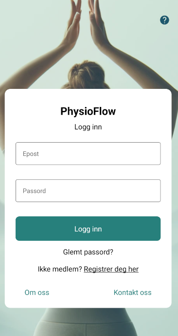
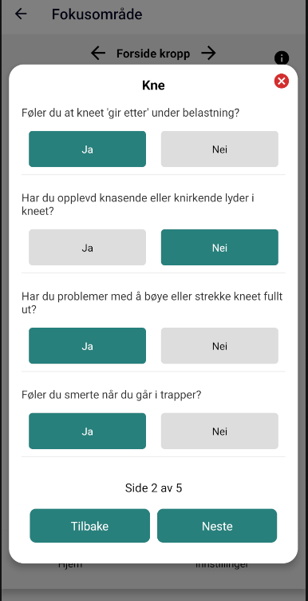
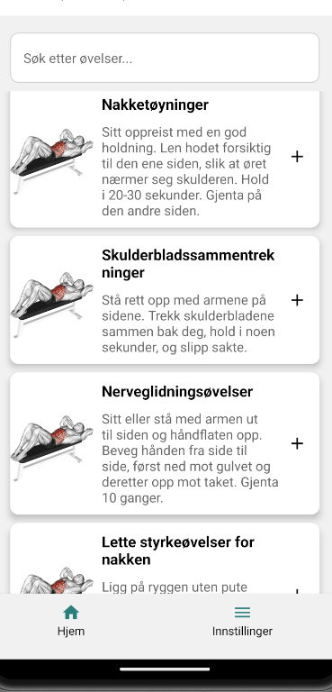

# PhysioFlow Prototype

## Table of Contents

- [Introduction](#introduction)
- [Features](#features)
- [Technology and Tools](#technology-and-tools)
- [Prerequisites](#prerequisites)
- [Getting Started](#getting-started)
  - [Clone Repository](#clone-repository)
  - [Install Dependencies](#install-dependencies)
  - [Start the Project](#start-the-project)
- [Simulator](#simulator)
  - [Android Emulator](#android-emulator)
  - [iOS Simulator](#ios-simulator)
- [Clearing Cache](#clearing-cache)
  - [Using Expo CLI](#using-expo-cli)
  - [Manually Clearing Cache](#manually-clearing-cache)

## Introduction

PhysioFlow is an application designed for physiotherapists and chiropractors to help patients and users get diagnosed and receive recommended rehabilitation exercises without having to be physically present with practitioners. Users register and enter information such as gender, weight, height, and age, and after answering a series of questions, they receive a diagnosis and recommended exercises or are advised to contact a practitioner if a diagnosis is not possible.

   

## Features
  **User Login**
- **User Registration:** Register user data such as gender, weight, height, and age.
- **Diagnosis and Exercises:** Receive a probable diagnosis and suggested exercises based on answers to questions about problem areas.

- **AI Interaction:** Basic setup for GPT-3.5 Chat for user interaction.

## Technology and Tools

- **Frontend:**
  - React Native
  - TypeScript
- **Backend:**
  - Node.js Express
- **Database:**
  - Firebase Firestore
- **Simulation:**
  - Expo GO
- **Platform:**
  - Android and iOS

## Prerequisites

- [Node.js](https://nodejs.org/en/) installed on your machine.
- [npm](https://www.npmjs.com/) installed on your machine.
- [Expo CLI](https://expo.dev/tools#cli) installed globally on your machine: `npm install -g expo-cli`

Create a `.env` file in the root directory for the **backend** with the following environment variables:
  - `OPENAI_API_KEY`: API key for OpenAI GPT-3.5.
  - `FIREBASE_PROJECT_ID`: Firebase Project ID.
  - `FIREBASE_PRIVATE_KEY`: Firebase Private Key.
  - `FIREBASE_CLIENT_EMAIL`: Firebase Client Email.

Create a `.env` file in the root directory for the **frontend** with the following environment variables:
  - `API_KEY`: API key for authentication.
  - `AUTH_DOMAIN`: Authentication domain.
  - `PROJECT_ID`: Project ID.
  - `STORAGE_BUCKET`: Firebase Storage Bucket.
  - `MESSAGING_SENDER_ID`: Sender ID for messaging service.
  - `APP_ID`: App ID for the React app.

## Getting Started
### Clone Repository

git clone https://github.com/TommyS-NO/PhysioFlow-Prototype.git
cd physioflow

### Install Dependencies

#### Install dependencies for frontend, backend, and root:

npm install

### Start the Project

##### Start the project from the root directory:
npm start

## Simulator
  To simulate the app during development, use Expo GO:

    - Open Expo GO: Start the Expo GO app on your mobile device.
    - Scan QR Code: Scan the QR code displayed in the terminal after running npm start.
    - Test the app: The app will open in Expo GO, where you can test its functionality on both Android and iOS.

#### Android Emulator
  Install Android Studio from Android Developer.
  Follow the instructions to set up a virtual device (AVD).

#### iOS Simulator

  Requires a Mac with Xcode installed from the Mac App Store.
  Open Xcode and go to Xcode > Preferences > Components to install a simulator.
## Clearing Cache

#### 1.Using Expo CLI

The simplest way to clear cache is to use the Expo CLI command expo start -c. This command restarts your project and clears the cache simultaneously.
#### 2. Manually Clearing Cache

Sometimes it may be necessary to clear the cache manually by deleting specific folders. This includes:

rm -rf node_modules
rm package-lock.json
rm -rf .expo
npm install
expo start -c

# Created By Team Leftovers #
  ## Tommy and Mina ##
  

